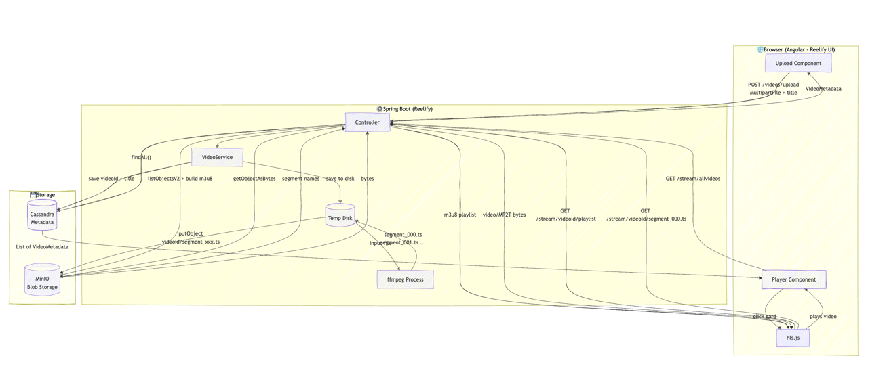
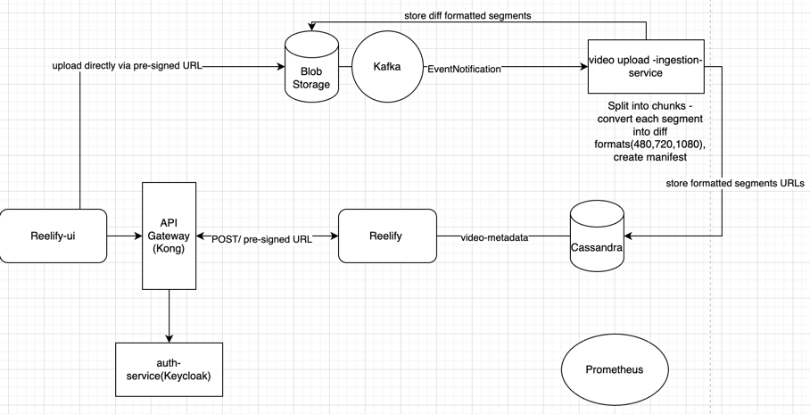

Steps:
1.  mvn clean+install
2. docker start reelify-cassandra
2. docker ps
3. Run application
Step 1 — Start Cassandra
   docker start reelify-cassandra
Step 2 — Start Kafka
   cd /Users/nitin/IdeaProjects/Reelify/kafka
   docker compose up -d
Step 3 — Verify everything is running
   docker ps
   You should see these containers running:
reelify-cassandra
reelify-kafka
reelify-kafka-ui
reelify-gateway      (Kong)
kong-keycloak-1      (Keycloak)

Once all containers are up:
Step 4 — Start both Spring Boot apps from IntelliJ
Start Reelify (main app) — port 8080
Start reelify-ingestion-service — port 8082
Step 5 — Open Kafka UI
Go to http://localhost:8090 in your browser. You should see the Kafka cluster with no topics yet — the video.uploaded topic will appear after the first message.




tbd


```
│
POST /videos/upload
│  ├── video file (multipart)
│  └── metadata (title, description, uploader, etc.)
│
Spring Boot
├── saves video binary ──→ Personal Server
└── saves metadata ──────→ Cassandra
```

## 1.Dependencies in pom.xml
#### For Cassandra:
```
docker run --name reelify-cassandra \
  -p 9042:9042 \
  -e CASSANDRA_CLUSTER_NAME=ReelifyCluster \
  -d cassandra:4.1
```
## 2.Open an interactive shell inside the running Docker container named reelify-cassandra, and run Cassandra’s command-line client cqlsh.
-it

* -i = keep STDIN open (interactive input)
* -t = allocate terminal
* cqlsh = Cassandra Query Language shell.
```
docker exec -it reelify-cassandra cqlsh
```

create
```
CREATE KEYSPACE reelify
WITH replication = {'class': 'SimpleStrategy', 'replication_factor': 1};
```

Angular → GET /presigned-url → Reelify → MinIO generates URL → returns to Angular
Angular → PUT video directly to MinIO (bypasses your backend entirely)
MinIO → fires event to Kafka topic "video-uploaded"
Ingestion Service → consumes event → transcodes → uploads segments → updates Cassandra