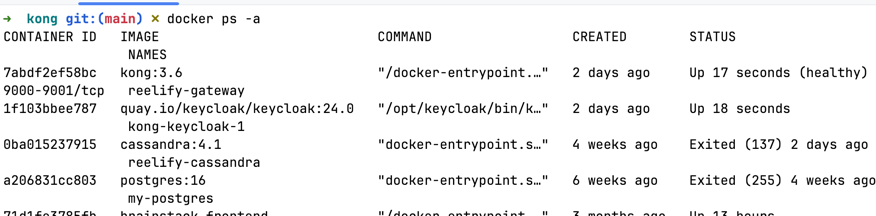
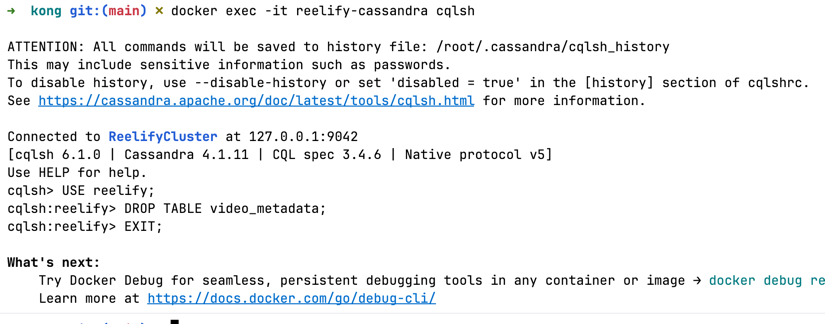

1. **VideoMetadata(Table class) will depend on VideoStatus(enum):**
VideoMetadata ----uses----> VideoStatus

2. **Drop the old Cassandra table**
The table was already created without the new columns. Cassandra won't auto-add them. Run this in cqlsh:

```
cd /Users/nitin/IdeaProjects/Reelify/kong
docker compose up -d
check - docker ps -a 

# Step 1 — start Cassandra
docker start reelify-cassandra

# Step 2 — wait ~15 seconds for it to fully boot, then open cqlsh inside the container
docker exec -it reelify-cassandra cqlsh

# Step 3 — once inside cqlsh, run:
USE reelify;
DROP TABLE video_metadata;
EXIT;
```
Spring Boot will recreate it with all 5 columns next time Reelify starts (because schema-action=create-if-not-exists is set).



