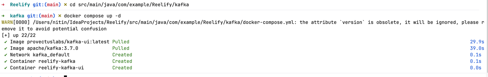

Added keycloak-service	        Routes /auth/** to Keycloak container
url: http://keycloak:8080	    Uses container name — works because both are on reelify-net
Added jwt plugin	            Protects /videos — any request without valid token gets 401
service: reelify-service	    JWT check only on videos, NOT on /auth (login must be public)


Always run from inside kong/ folder
```
cd kong
docker-compose down
docker-compose up
```

Keycloak is up
Open browser → http://localhost:8081

Should show Keycloak login page. Login with:
Username: admin
Password: admin

*Now configure Keycloak*
Step 1 — Create a new Realm
Never use master realm for your app — it's for Keycloak admin only.

Click Keycloak dropdown (top left)
Click Create Realm
Realm name: reelify
Click Create

Step 2 — Create a Client
Click Clients in left menu
Click Create client
Fill in:
Client ID: reelify-client
Click Next
On Capability config screen:
Turn ON Client authentication
Turn ON Direct access grants ← allows username/password login
Click Next → Save

Step 3 — Create a test User
Click Users in left menu
Click Create new user
Fill in:
Username: testuser
first name = test
last name = user
Click Create
Go to Credentials tab
Click Set password
Password: password123
Temporary: OFF
Click Save
remove 'Required user actions' from Users -> details
Email is set as Required field = OFF if testuser has no email.

Step 4- Add passowrd 


Step 5 — Test login (get a token)
Run this in terminal:

`curl -X POST http://localhost:8081/realms/reelify/protocol/openid-connect/token \
-H "Content-Type: application/x-www-form-urlencoded" \
-d "grant_type=password" \
-d "client_id=reelify-client" \
-d "client_secret=IUFpiDANiLrQXbAetaUAV2Xzgq4a1KaW" \
-d "username=testuser" \
-d "password=password123"`

Get client_secret from: Clients → reelify-client → Credentials tab



